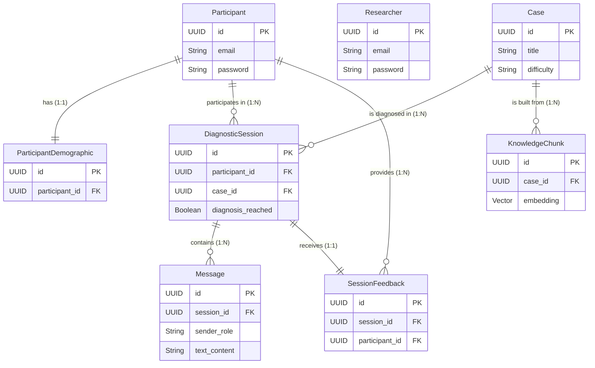

# Marta

An AI-powered virtual patient chatbot built for a dental education research study at a Saudi Arabian university. Dental students diagnose simulated operative dentistry cases through natural-language conversation with an AI patient; researchers use the platform to run the study and collect data for analysis.

## What this project is

Marta simulates four operative dentistry scenarios so 3rd and 4th year dental students can practice diagnostic conversations with a virtual patient over a 4-week study period. The study tracks diagnostic accuracy, satisfaction, perceived realism, diagnostic confidence, and curricular value via a 12-item questionnaire.

Long-term, the plan is to grow this beyond a single study into a platform researchers at other institutions can use for their own studies.

## Tech stack

**Backend**
- Java 21, Spring Boot 3.5.x
- PostgreSQL + pgvector (hosted on Neon)
- LangChain4j for RAG orchestration
- Claude API (Anthropic) as the underlying model for the virtual patient
- JWT for auth session tokens
- Argon2 (via Spring Security crypto) for password/PIN hashing
- Resilience4j for rate limiting on auth endpoints

**Frontend**
- Next.js (React) with TypeScript
- Deployed on Vercel

**Infrastructure**
- Backend deployed on AWS
- Frontend deployed on Vercel
- Database hosted on Neon

## Project structure

```
marta/
├── backend/                   # Spring Boot application
│   ├── src/main/java/com/marta/
│   │   ├── auth/              # JWT auth, registration, login, password reset
│   │   ├── chat/              # Diagnostic sessions, AI chat, message history
│   │   ├── feedback/          # 12-item research survey API
│   │   ├── knowledge/         # RAG pipeline, PDF ingestion, case management
│   │   └── common/            # Health check, global error handling, config
│   ├── src/main/resources/
│   │   └── application.properties
│   ├── pom.xml
│   └── mvnw
├── frontend/                  # Next.js application (TypeScript)
│   ├── src/app/               # App Router pages
│   ├── package.json
│   └── next.config.ts
├── api-contract/              # API documentation
│   ├── auth.md                # Authentication endpoints
│   └── core-api.md            # Chat, cases, feedback, knowledge endpoints
├── README.md
├── PLAN.md
└── PROJECT.md
```

## Getting started

### Backend
```bash
cd backend
./mvnw spring-boot:run
```

### Frontend
```bash
cd frontend
npm install
npm run dev
```

### Required environment variables

| Variable | Used for |
|---|---|
| `CLAUDE_API_KEY` | Anthropic API access for the virtual patient |
| `JWT_SECRET` | Signing key for auth tokens |
| `DATABASE_URL` | Neon Postgres connection string |

## Status

- ✅ Participant-side auth (register, login, reset password) — complete
- ✅ Researcher-side auth (login) — complete
- ✅ AI chat / diagnostic session feature — complete (Claude + LangChain4j + structured JSON)
- ✅ 12-item Feedback & Rate Limiting — complete
- ✅ Hybrid RAG Vector Pipeline (pgvector) — complete
- ✅ Culturally authentic Saudi patient cases — complete
- ✅ Student case dashboard with progress tracking — complete


- ✅ Tests, CI/CD pipeline, containerization — complete
- ✅ Redis Caching & Java 21 Virtual Threads — complete

## 🚀 Performance & Benchmarks

To ensure enterprise-grade scalability and security, the backend was rigorously load-tested and optimized. Below are the official benchmark results, along with the commands to verify them locally.

### 1. Backend Scalability (Apache Bench)
Tested the API under high concurrency (100 simultaneous users sending 1,000 requests) to measure the impact of Java 21 Virtual Threads combined with a Redis caching layer.

*   **Base Case (Standard Java + No Cache):** 46 req/s | 2,173 ms average latency
*   **Fully Optimized (Virtual Threads + Redis Cache):** 67 req/s | 1,476 ms average latency
*   **Result:** 45% increase in throughput and a massive reduction in database load.

**How to verify yourself:**
```bash
# Run 1000 requests with 100 concurrent users
ab -n 1000 -c 100 http://localhost:8080/marta/api/v1/cases
```

### 2. Security & Rate Limiting (Resilience4j)
Implemented Resilience4j to protect the authentication endpoints from brute-force attacks (limited to 5 attempts per minute).
*   **Test:** 100 simulated login attempts in 1 second.
*   **Result:** 5 allowed, 95 blocked (`429 Too Many Requests`). 95% brute-force mitigation rate.

**How to verify yourself:**
```bash
# Simulate a brute-force attack
echo '{"pin":"1234"}' > dummy.json && ab -n 100 -c 10 -T 'application/json' -p dummy.json http://localhost:8080/marta/api/v1/auth/login
```

### 3. Code Quality & Test Coverage (JaCoCo)
The backend core business logic is tested using JUnit 5 and Mockito.
*   **Result:** 53% unit test coverage.

**How to verify yourself:**
```bash
cd backend
./mvnw clean test jacoco:report
# Open the generated HTML report at: backend/target/site/jacoco/index.html
```

## Database Schema (Entity Relationship)



Architecural Decisions:

- Why postgres over other databases?
I choose postgresSQL, because this is an AI-driven application, by using the pg-vector extension, my postgres database can act as both a traditional database and a vector database for AI knowledge chunks. Thinks means i did not have to pay or maintain seperate vector databases like pinecone, this 
kept my architecure simple, fast and cost-effective.

- How do we handle 1 million messages in our DB ensuring fast retrival time?
I have added an index to the session_id column of the database this ensures, postgres create a 
B-tree index lookup for the sessionID column so it does not have to scan each row, this ensures lookup times remain fast.

- Why the Participant Demographic table and the Participant table in one singe table?
I used data normalization the participant data is strictly for authentication and core identity, by
seperating the demographics into a 1-to-1 relationship, we keep the auth table lightweight and fast, 
It also makes it easier to query demographics for research without accidently pulling sesitive login
credentials.

- How did i cater for the N+1 Springboot JPA trap ?
I opted for a lossely coupled architecure by storing raw UUID instead, instead of using @ManyToOne
annotation. While i lose the convinience of Hibernate's cascading save which is not a major concern for this project, I prefer this approach becuase it makes my database queries 100% perdictable, completely eliminates the N+1 problem, and makes the architecture easier to split into Microservices later if we need to scale while to be fair is not a major concern for this project but an overall advantage of a lossely coupled architecture.

- Why UUID over standard squential integers ? 
I choose UUID's for a two main reason. First, Security (Insercure Direct Object Reference - IDOR). 
If my sessions used sequential ID, malicious user could look at their URL, guess that the next interger might exist which would cause them to access some other uses chat which would be a major 
security voilation. Second reason being scalability, if an app scales to multiple database servers, 
generating ID's across different servers, can cause collision, UUID's are univeresly unique, so 
they prevent collisions.

- What are ACID properties and how do you ensure data safety?
ACID stands for Atomicity, Consistency, Isolation, and Durability. It guarantees that database transactions are processed reliably, like an 'All-or-Nothing' operation, so data never gets corrupted if the server crashes halfway through. In Spring Boot, I use the `@Transactional` annotation on my Service methods. This ensures that if a multi-step database operation fails halfway, everything is safely rolled back.

- Why RAG instead of Fine-Tuning a custom AI model?
I chose RAG (Retrieval-Augmented Generation) because fine-tuning is expensive and inflexible. If a medical fact changes, I would have to retrain a fine-tuned model. With RAG, if data changes, I just update a single row in my PostgreSQL database. Furthermore, RAG drastically reduces AI "hallucinations" because I force the AI to read my exact database chunks before answering.

- Why use LangChain4j instead of calling the AI API directly?
I used LangChain4j because it abstracts away the complex boilerplate of AI integration, like managing chat memory and calculating vector math for RAG. More importantly, it keeps my code Model-Agnostic. If I ever need to switch from Claude to OpenAI (ChatGPT), I can do it by changing a single line of config without rewriting my business logic.

- Why Anthropic (Claude) over OpenAI (ChatGPT)?
I chose Anthropic because Claude is widely considered the industry leader for Persona Adoption and Long-Context Reasoning. Since my app requires the AI to act like a specific patient in a diagnostic session, Claude is much better at staying in character and not breaking the illusion compared to ChatGPT.

- How do you generate your Vector Embeddings for RAG?
Instead of paying Anthropic or OpenAI every single time we need to generate an embedding for text, I used the HuggingFace integration (`langchain4j-hugging-face`). This allows us to use open-source, free embedding models (like `all-MiniLM-L6-v2`) locally to turn our text into vectors. We only pay Anthropic for the final chat generation, which drastically cuts down our API costs.

- Is it safe to use `ddl-auto=update` for database management in production?
No, it is highly dangerous for production because Hibernate might accidentally drop a column or lock a table. It is strictly for rapid prototyping in development. In a real production environment, I would set it to `none` or `validate`, and use a proper schema migration tool like Flyway or Liquibase to safely version-control database changes.

- How did you protect your AI API from spam and your login endpoints from brute-force attacks?
I implemented Rate Limiting at the architectural level using the Resilience4j library. I configured the API to only allow 5 login attempts per minute to prevent hackers from brute-forcing passwords. For the AI chat, I limited it to 1 message every 3 seconds per user to prevent someone from spamming the system and running up my Anthropic API bill.

- How do you handle errors gracefully without crashing the server or leaking Java code?
I implemented a Global Exception Handler using Spring's `@ControllerAdvice`. Instead of crashing or leaking Java stack traces to the frontend, my backend intercepts every error across the entire application and formats it into a clean, unified JSON response (e.g., `{"error": "Session not found", "status": 404}`). This ensures the frontend always receives predictable errors it can display to the user.


See `PROJECT.md` for the full feature breakdown.
See `api-contract/` for complete API documentation.